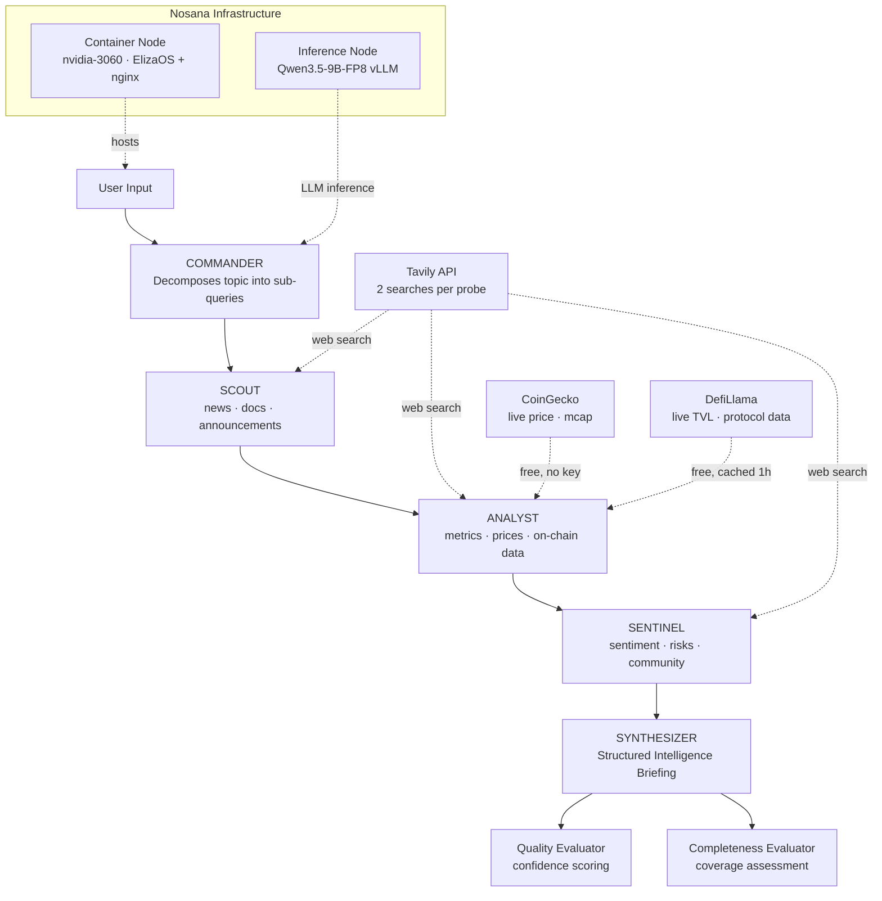

# PROBE - Web3 Intelligence Swarm

Multi-agent Web3 research system built on ElizaOS v2, deployed on Nosana's decentralized GPU network.

**Live demo:** https://2vdsgagfth9ifxcsfzfcbmdbisjg6wajlypulxuagpjy.node.k8s.prd.nos.ci

PROBE runs five specialized components: Commander decomposes your topic into focused sub-queries, Scout, Analyst, and Sentinel each run sequential web searches from their own angle, and Synthesizer merges all findings into a structured intelligence briefing with confidence scores. The agent monitors its own Nosana infrastructure and reports live deployment status, GPU market, and credit balance.

## Architecture



Probes run sequentially on Nosana's single-GPU vLLM. Each probe runs 2 focused Tavily web searches, places results first in the LLM prompt, and cites URLs for every finding.

### ElizaOS Plugin

Full ElizaOS v2 plugin (not just a character file):

| Type | Components |
|------|-----------|
| Actions | `RESEARCH_TOPIC`, `CHECK_INFRASTRUCTURE` |
| Providers | `ResearchStateProvider`, `HistoryProvider`, `InfrastructureProvider` |
| Evaluators | `QualityEvaluator`, `CompletenessEvaluator` |

## Frontend

Next.js 16 dashboard with 5 pages:

| Page | Purpose |
|------|---------|
| **Research** | Topic input, animated probe node graph, intelligence briefing display |
| **History** | Past research sessions saved to localStorage |
| **Watchlist** | Track projects for periodic re-research |
| **Infrastructure** | Live Nosana deployment health: status, market, credits, latency |
| **Settings** | Probe behavior configuration |

## Tech Stack

| Component | Technology |
|-----------|-----------|
| Agent Framework | ElizaOS v2 |
| Model | Qwen3.5-9B-FP8 via Nosana vLLM inference |
| Web Search | Tavily API |
| Market Data | CoinGecko API (free) + DefiLlama API (free) |
| Nosana Integration | Nosana REST API (deployment status + credits) |
| Frontend | Next.js 16, Tailwind CSS v4, Framer Motion, Recharts |
| Deployment | Nosana Decentralized GPU Network |
| Blockchain | Solana |

## Quick Start

### Prerequisites

- Node.js 23+
- pnpm (`npm install -g pnpm`)
- ElizaOS CLI (`npm install -g @elizaos/cli`)

### Local Development

```bash
# Clone
git clone https://github.com/jordi-stack/agent-challenge
cd agent-challenge

# Configure environment
cp .env.example .env
# Edit .env: set TAVILY_API_KEY (and optionally NOSANA_API_KEY + NOSANA_DEPLOYMENT_ID)

# Install dependencies
pnpm install

# Apply vLLM compatibility fix (3 patches, required after every pnpm install)
FILE=$(find node_modules/.pnpm -path "*/@elizaos/plugin-openai/dist/node/index.node.js" | grep -v patches | head -1)

# Patch 1: Responses API
sed -i 's/openai\.languageModel(modelName)/openai.chat(modelName)/g' "$FILE"

# Patch 2+3: developer role + disable thinking mode
printf 'const _origFetch = globalThis.fetch;\nglobalThis.fetch = async (url, opts) => {\n  if (typeof url === "string" && url.includes("/chat/completions") && opts && opts.body) {\n    try {\n      const b = JSON.parse(opts.body);\n      if (b.messages) b.messages.forEach(m => { if (m.role === "developer") m.role = "system"; });\n      b.chat_template_kwargs = { enable_thinking: false };\n      opts = { ...opts, body: JSON.stringify(b) };\n    } catch(e) {}\n  }\n  return _origFetch(url, opts);\n};\n' | cat - "$FILE" > /tmp/fixed.js && mv /tmp/fixed.js "$FILE"

# Start agent (port 3000)
elizaos dev

# In another terminal, start frontend (port 6969)
cd frontend && npm install && npm run dev
```

### Environment Variables

```env
OPENAI_API_KEY=nosana
OPENAI_BASE_URL=https://5i8frj7ann99bbw9gzpprvzj2esugg39hxbb4unypskq.node.k8s.prd.nos.ci/v1
OPENAI_API_URL=https://5i8frj7ann99bbw9gzpprvzj2esugg39hxbb4unypskq.node.k8s.prd.nos.ci/v1
MODEL_NAME=Qwen3.5-9B-FP8
OPENAI_SMALL_MODEL=Qwen3.5-9B-FP8
OPENAI_LARGE_MODEL=Qwen3.5-9B-FP8
OPENAI_EMBEDDING_URL=https://4yiccatpyxx773jtewo5ccwhw1s2hezq5pehndb6fcfq.node.k8s.prd.nos.ci/v1
OPENAI_EMBEDDING_API_KEY=nosana
OPENAI_EMBEDDING_MODEL=Qwen3-Embedding-0.6B
OPENAI_EMBEDDING_DIMENSIONS=1024
TAVILY_API_KEY=your_tavily_key_here
SERVER_PORT=3000

# Nosana API — enables live deployment status on the Infrastructure page
# Get API key: deploy.nosana.com → Account
# Get Deployment ID: Nosana dashboard after first deploy
NOSANA_API_KEY=nos_your_api_key_here
NOSANA_DEPLOYMENT_ID=your_deployment_id_here
```

## Deploy to Nosana

### Step 1: Build and push Docker image

```bash
docker build --network host -t jordistack/probe-web3-intelligence:v16 .
docker push jordistack/probe-web3-intelligence:v16
```

The Dockerfile applies the vLLM fix automatically during build and uses nginx (port 80) to serve the frontend at `/` and proxy `/api/*` to ElizaOS.

### Step 2: Deploy via Nosana Dashboard

1. Go to [deploy.nosana.com](https://deploy.nosana.com)
2. Create a new deployment with the contents of `nos_job_def/nosana_eliza_job_definition.json`
3. Set `TAVILY_API_KEY` and `NOSANA_API_KEY` to your real values
4. After deploy, copy the Deployment ID from the dashboard and set it as `NOSANA_DEPLOYMENT_ID`
5. Strategy: **Infinite**, Timeout: **6h**

### Step 3: Deploy via Nosana CLI

```bash
npm install -g @nosana/cli

nosana job post \
  --file ./nos_job_def/nosana_eliza_job_definition.json \
  --market nvidia-3060 \
  --timeout 21600 \
  --api <YOUR_NOSANA_API_KEY>
```

## Nosana API Integration

PROBE calls the [Nosana REST API](https://learn.nosana.com/api/intro.html) (`https://dashboard.k8s.prd.nos.ci/api`) at two levels:

**Backend (`src/utils/nosana-client.ts`):**
- `GET /deployments/{id}` — deployment status, market, strategy, replicas, timeout
- `GET /credits` — remaining NOS credit balance
- Used by the `CHECK_INFRASTRUCTURE` action and `infrastructure` provider, so the agent itself knows its own Nosana deployment state

**Container (`start.sh`):**
- Background loop polls both endpoints every 60 seconds
- Writes results to `/app/frontend/out/nosana-status.json` (nginx serves it as a static file)
- Frontend fetches `/nosana-status.json` without exposing the API key to the browser

**Frontend (`frontend/app/infrastructure/page.tsx`):**
- Displays live deployment data: ID, status, market, strategy, replicas, timeout
- Shows remaining NOS credit balance
- Refreshes every 60 seconds

### Deployment Strategy

PROBE uses the **INFINITE** strategy because it runs a persistent ElizaOS server across multiple research requests. A `SIMPLE` job terminates after the timeout. `INFINITE` keeps the agent alive until manually stopped, which matches the always-on research assistant model.

### Why nvidia-3060

PROBE's Docker container (ElizaOS agent + nginx) runs on an NVIDIA 3060 node, but the 3060 does no model inference. All LLM calls go to a separate Nosana-provided vLLM endpoint (`5i8frj7ann99b...node.k8s.prd.nos.ci/v1`) that serves Qwen3.5-9B-FP8 on dedicated inference hardware.

The 3060 is the right choice for the container host: it runs a Node.js process and nginx, which need RAM and CPU, not VRAM. Using a cheaper GPU tier for the agent container keeps cost down while the inference endpoint handles the heavy compute separately.

This means PROBE uses Nosana at two layers: container hosting and model inference, both on decentralized GPU infrastructure.

## Project Structure

```
agent-challenge/
├── characters/
│   └── probe.character.json        # PROBE agent character
├── src/
│   ├── index.ts                    # Project entry point (exports agents array)
│   ├── actions/
│   │   ├── research-topic.ts       # Multi-probe research orchestration
│   │   └── check-infra.ts          # Nosana self-monitoring
│   ├── providers/
│   │   ├── research-state.ts       # Active research tracking
│   │   ├── history.ts              # Past research access
│   │   └── infrastructure.ts       # Runtime metrics + Nosana deployment state
│   ├── evaluators/
│   │   ├── quality.ts              # Confidence scoring
│   │   └── completeness.ts         # Coverage assessment
│   ├── probes/
│   │   └── personas.ts             # Scout, Analyst, Sentinel system prompts
│   ├── types/index.ts
│   └── utils/
│       ├── research-store.ts       # In-memory research persistence
│       ├── metrics.ts              # Runtime metrics collection
│       ├── web-search.ts           # Tavily integration
│       ├── defillama-client.ts     # DefiLlama TVL + protocol data (free, cached 1h)
│       ├── coingecko-client.ts     # CoinGecko price + market cap (free, no key)
│       └── nosana-client.ts        # Nosana REST API client (deployment + credits)
├── frontend/                       # Next.js 16 dashboard
│   └── app/
│       ├── page.tsx                # Research page (main)
│       ├── history/page.tsx
│       ├── watchlist/page.tsx
│       ├── infrastructure/page.tsx
│       ├── settings/page.tsx
│       ├── components/             # 15 components
│       └── lib/
│           ├── eliza-client.ts     # ElizaOS v2 messaging API client
│           ├── llm.ts              # Probe persona prompts
│           └── use-local-storage.ts # localStorage persistence hook
├── nos_job_def/
│   └── nosana_eliza_job_definition.json
├── Dockerfile                      # Multi-stage: nginx + ElizaOS, port 80
├── nginx.conf                      # Reverse proxy config (520s timeout for long research)
└── start.sh                        # Startup: Nosana polling + ElizaOS restart loop + nginx
```

## How PROBE Works

1. You enter a topic (e.g., "Nosana decentralized GPU compute network")
2. **Commander** decomposes it into 3 focused sub-queries
3. **Scout** runs 2 Tavily searches for recent news and documentation
4. **Analyst** fetches live price + market cap from CoinGecko and TVL from DefiLlama, then runs 2 Tavily searches for on-chain metrics and revenue data
5. **Sentinel** runs 2 Tavily searches for community sentiment and social buzz
6. **Synthesizer** merges all findings into a structured intelligence briefing
7. **Quality Evaluator** scores confidence based on URL citations, data points, structure
8. **Completeness Evaluator** checks all research angles were covered

Total: 5 LLM calls + 6 web searches per research session (~120-300 seconds on Qwen3.5-9B-FP8). LLM calls retry up to 2 times with backoff on 5xx errors to handle transient vLLM endpoint failures.

## Troubleshooting

**DB migration error** (`Failed query: CREATE SCHEMA IF NOT EXISTS migrations`):
```bash
rm -rf .eliza && elizaos dev
```

**Agent not responding after deploy:** ElizaOS takes 30-60 seconds to fully initialize after container start. Wait and refresh.

**Infrastructure page shows "Offline":** Check that nginx is proxying `/api/*` to ElizaOS on port 3000. The frontend uses relative URLs built with `NEXT_PUBLIC_AGENT_API=""`.

**vLLM fix not applied:** Docker build will now fail with an explicit error if `plugin-openai` dist file is not found. Check build logs for `vLLM fix applied to:` confirmation.

**LLM 503 errors during research:** Nosana's inference endpoint can return transient 503/502/504 responses when under load or during cold starts. PROBE retries each LLM call up to 2 times with 2s/5s backoff, so a single blip won't poison the whole report. Sustained 503s indicate the endpoint is down: check https://deploy.nosana.com or the Nosana Discord for status.

## Submission Checklist

- [x] Fork this repository and build the agent on the `elizaos-challenge` branch
- [x] Build a frontend/UI for interacting with the agent ([frontend/](frontend/))
- [x] Deploy to Nosana and get a public deployment URL
- [x] Star the following repositories:
  - [x] [nosana-ci/agent-challenge](https://github.com/nosana-ci/agent-challenge)
  - [x] [nosana-ci/nosana-programs](https://github.com/nosana-ci/nosana-programs)
  - [x] [nosana-ci/nosana-kit](https://github.com/nosana-ci/nosana-kit)
  - [x] [nosana-ci/nosana-cli](https://github.com/nosana-ci/nosana-cli)
- [x] Social media post: https://x.com/jordialter/status/2043989481255252424
- [x] GitHub fork link: https://github.com/jordi-stack/agent-challenge
- [x] Nosana deployment URL: https://2vdsgagfth9ifxcsfzfcbmdbisjg6wajlypulxuagpjy.node.k8s.prd.nos.ci
- [x] Agent description (see top of this README, under 300 words)
- [x] Video demo: https://youtu.be/vHn6YVYFDC0

## License

MIT
